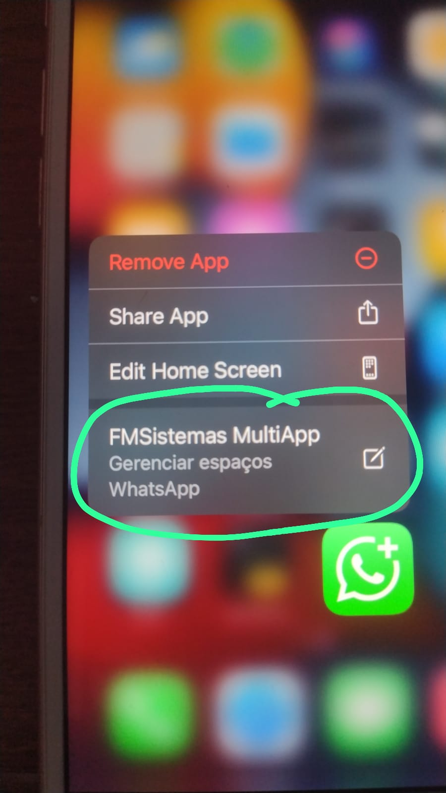

# ZapMod MultiApp — Free Edition 📱⚡

Welcome to **ZapMod MultiApp**, an advanced iOS tweak that brings multiple independent WhatsApp sessions natively to your device!

## 🚀 Features (Free Edition)
- **True Sandboxing:** Creates independent application containers for each session.
- **Switch Session:** Jump seamlessly between up to **4 distinct WhatsApp accounts**.
- **No Bans & No Modded Apps:** It hooks into the official WhatsApp binary, leaving the core cryptographic and connection signatures intact. 
- **TrollStore Ready:** Fully compatible with TrollStore (rootless).

## 🔒 Limitations of the Free Edition
This Free version is provided for the community and is limited to **4 active sessions**. 
Advanced features (such as bulk session creation, UI automated payloads, broadcast interceptions, XMPP diagnostics, and limitless accounts) are exclusively reserved for the Developer/Premium build.

---

## 🛠️ Installation Guide (TrollFools)

**Prerequisites:** Your device MUST have [TrollFools](https://github.com/Lessica/TrollFools) installed (requires TrollStore/Jailbreak). This tweak must be injected directly into the official App Store version of WhatsApp. It CANNOT be installed as a standalone cloned app (TIPA/IPA).

1. Download the latest [ZapModFree-Release-v6.9.24.zip](https://github.com/malmeida76/fm_multi_zap/releases/download/v6.9.24/ZapModFree-Release-v6.9.24.zip) from the **Releases** tab and extract the `.dylib` file.
2. Open **TrollFools** on your device.
3. Select **WhatsApp** from the list of applications.
4. Tap **"Inject"** and select the extracted `ZapModFree-v6.9.24.dylib`.
5. After injection succeeds, open WhatsApp.
6. **Important:** Access the **FMSistemas MultiApp** menu via the iOS Home Screen Quick Actions (3D Touch / Haptic Touch on the WhatsApp icon).

## 💡 How to Use
1. **Force Touch** the WhatsApp icon on your Home Screen.
2. Select **"FMSistemas MultiApp"** from the shortcut menu.
3. Tap **"SWITCH SESSION"** to create or swap to a new instance.
4. When swapping, WhatsApp will automatically close. Just open it again and you will be in your new empty session, ready to register another number!
5. To clear a session's data, use the **"CLEAR"** button in the MultiApp menu.

---

## 🛑 Support & Source Code
Developed by **FMSistemas**. 
For bug reports, source code, or further development inquiries, please open an Issue on this repository.

*(Disclaimer: This is a third-party modification. Use at your own risk. FMSistemas is not responsible for any blocked accounts, although our sandbox methodology is heavily tested to prevent detections).*
